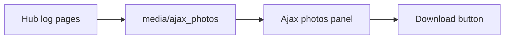

# MotionCam photo gallery

Photo 1, Photo 2, and Photo 3 show up under Sensors because Home Assistant’s device page hardcodes the `image` domain into that card (`SENSOR_ENTITIES` includes `image`). The empty area under Activity is just unused column space. An integration cannot draw a card there.

Photo 2 and Photo 3 are Unavailable because those entities are empty frame slots, not extra pictures.

## What will change

Only the photo feature in [custom_components/ajax/image.py](custom_components/ajax/image.py) and the parser in [custom_components/ajax/\_motioncam_photos.py](custom_components/ajax/_motioncam_photos.py).

- On setup, remove the existing `*_photo_*` entity-registry rows for this config entry so Photo 1–3 disappear from Sensors.
- Stop creating image entities. The refresh loop stays, but it no longer publishes sensor rows.
- Save every READY JPEG from the hub log, not only the latest burst. Files go to Home Assistant’s media folder: `config/media/ajax_photos/<device id>/<timestamp>_<frame>.jpg`. A file that is already there is not downloaded again. Keep the newest 100 photos per device and delete older files.
- Poll page 1 of the hub log as today. The first successful poll also walks a few older pages so photos already in the Ajax app are backfilled.
- Add a sidebar panel **Ajax photos**. It is a scrollable list, newest first, grouped by the time Ajax took them. Each picture has a Download button. The button returns the saved JPEG with `Content-Disposition: attachment`, so the browser stores it locally the way the Ajax app’s download button does. The page requires a logged-in Home Assistant user.

The **Photo received** Activity line stays. It is attached to the MotionCam motion entity (`{entry}_{device}_motion`) so it still shows on that device after the image entities are gone.

## Tests

- Parser returns every burst for one device, still dropping failed links and other devices.
- Refresh writes JPEGs and does not call `async_add_entities`.
- A second refresh does not download a file that already exists.
- Download response is the JPEG with an attachment filename.
